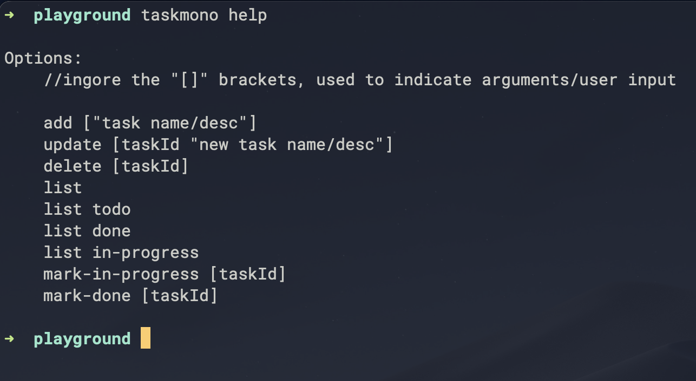
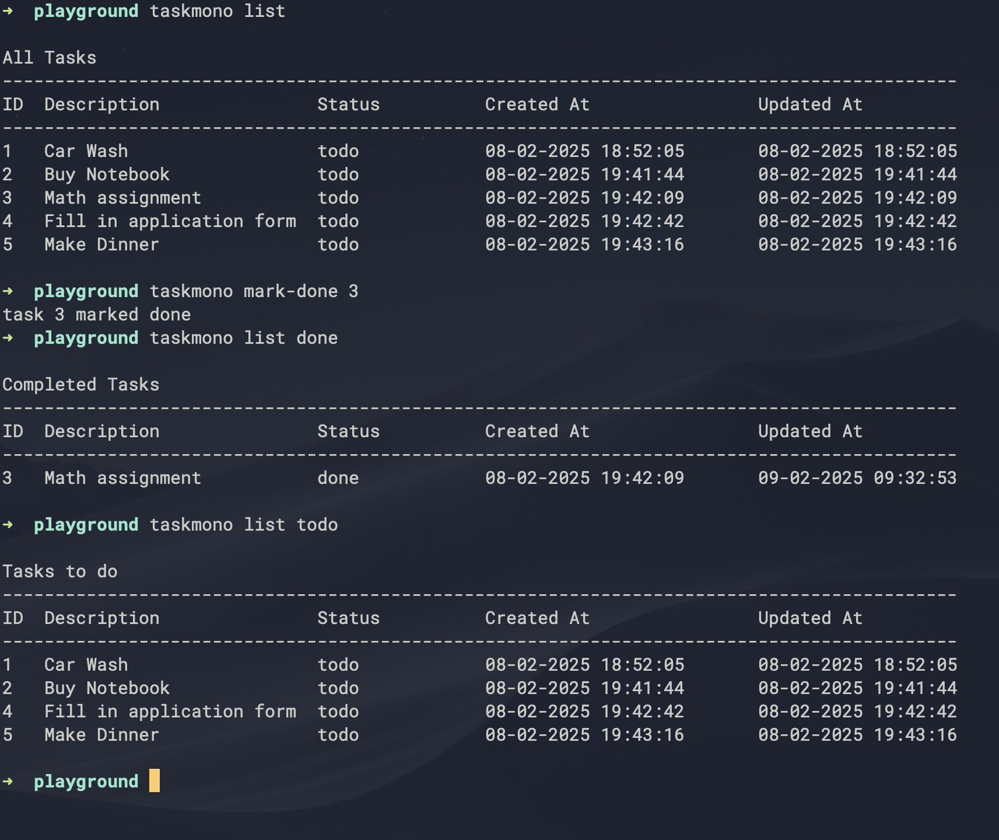

# Taskmono 

---

---

Taskmono is a Command Line Task Tracking app, where you can,

- Add, update and delete tasks
- Mark them in-progress or done
- display all, todo, in-progress or completed tasks

### Contents

- [Taskmono](#taskmono)
    - [Contents](#contents)
    - [Installation (UNIX/Linux)](#installation-unixlinux)
    - [Usage](#usage)

### Installation (UNIX/Linux)

Note:  If you do not want to perform any installation, you may simply run the `main.py` file using `python3 main.py help`

However by installing, you can run the task tracker program using the `taskmono` command (*or any other custom command, check step 6*) from any location.

1. Clone this repo or download and extract the project folder 
2. Move the project directory into a not so temporary location (moving it after installation requires re-configuring symlinks)
3. Change permission of `main.py` file to make it executable
        
        $chmod 744 main.py

4. If not exists, Create a customized directory for local/user scripts, try to check

        $cd $HOME/bin
    
    If it does not exist, then

        mkdir $HOME/bin

5. Add this dir to PATH, copy paste the following in your `.bashrc` or `.zshrc` file

        export PATH="$PATH:$HOME/bin"

6. Create a SYMLINK in `$HOME/bin` directory to execute the script using the `taskmono` command.

        $ln -s path/to/taskmono/main.py $HOME/bin/taskmono

    If you want to use any other command other than `taskmono` you can simply insert your command in place of `taskmono`

        //optional custom command
        $ln -s path/to/taskmono/main.py $HOME/bin/<your custom command>

7. Refresh the shell by

        $. $HOME/.zshrc
        //or
        $. $HOME/.bashrc

8. Try
        
        $taskmono help

9. Use alias for quick command (Optional)

    Ex: Add the following line of code in `.zshrc` or `.bashrc`

        alias tm="taskmono"

    Now run taskmono using `tm`

        $tm list

---
### Usage

1. `help` - prints all commands

		$taskmono help
		
		Options:
		
	    //ingore the "[]" brackets, used to indicate arguments/user input
	
	    add ["task name/desc"]
	    update [taskId "new task name/desc"]
	    delete [taskId]
	    list
	    list todo
	    list done 
	    list in-progress
	    mark-in-progress [taskId]
	    mark-done [taskId]

2. `add` - create a new task

        $taskmono add "Car wash"
        $taskmono add "Fix Desk Setup"
		
3. `list` - display all tasks

		$taskmono list

4. `update` - update task description

        $taskmono update 1 "Car Wash and Servicing"

5. `delete` - delete a task using ID

        $taskmono delete 1 

6. `mark-in-progress` - mark a task in progress

        $taskmono mark-in-progress 1

7. `mark-done` - mark a task as done

        $taskmono mark-done

8. `list todo` `list in-progress` `list done` - display tasks based on status

        $taskmono list todo
        $taskmono list in-progress
        $taskmono list done

